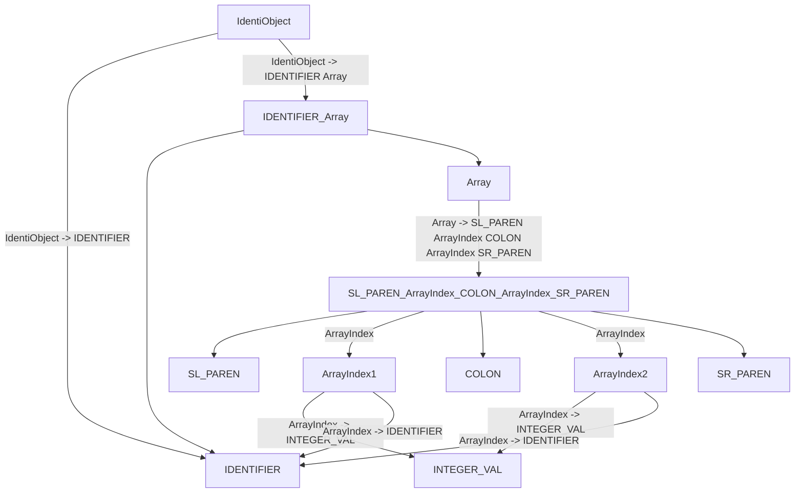

# 《编译原理》课程实验6报告

## 0221120281 文天鑫

### 实验目的

根据所学内容为扩展的PL0语言实现一个编译器，此次报告为汇总报告

### 实验环境

- `GNU Flex` --词法分析模块
- `GNU Bison` --语法分析模块
- `Graphviz`、`dot`
- `C++`、`Python` --`C++`为主要实现语言实现语言、`Python`为语法树可视化实现的语言
- `SPIM Simulator` -- 汇编器，用来将目标代码转化为机器码

### 编译方式

在各个模块的目录下`make`即可，注意实验环境要求！

### 实验思路、内容与改进

#### 词法分析与语法分析

即文件夹下的`Lexer`与`Parser`部分。

##### 扩充PL0语言的EBNF范式

<程序> ::= <分程序>.

<分程序> ::= [<常量说明部分>] [<变量说明部分>] [<过程说明部分>] <语句>

<常量说明部分> ::= const <常量定义> { , <常量定义> };

<常量定义> ::=   <标识符> = <无符号整数>

<无符号整数> ::= <数字>{<数字>}

<变量说明部分> ::= var <变量声明> { , <变量声明> } ;

**<变量声明> ::= <标识符> | <标识符>(<数组界>:<数组界>）**

**<数组界> ::= <标识符> | <无符号整数>**

<标识符> ::= <字母>{<字母>|<数字>}

<过程说明部分> ::= <过程首部> <分程序> {; <过程说明部分> }; 

<过程首部> ::= procedure *<*标识符>

<语句> ::= <赋值语句> | <复合语句> | <条件语句> | <当型循环语句> | <重复语句> | <过程调用语句> | <读语句> | <写语句>

<赋值语句> ::= <变量引用>:=<表达式>

<变量引用> ::= <标识符> | <标识符>‘(‘<表达式> ‘)’

<复合语句> ::= begin <语句>{;<语句>}end

**<条件语句> ::= if <条件> then <语句> [else <语句>]**

<条件> ::= <表达式><关系运算符><表达式>|odd<表达式>

<表达式> ::= [+|-]<项>{<加法运算符><项>} 

<项> ::= <因子>{ <乘法运算符><因子> } 

<因子> ::= <变量引用> | <无符号整数> | ‘(‘<表达式>’)’

<加法运算符> ::= + | -

<乘法运算符> ::= * | /

<关系运算符> ::= = | # | < | <= | > | >=

<当型循环语句> ::= while <条件> do <语句>

<过程调用语句> ::= call <标识符>

<传值参数> ::= <表达式>

<读语句> ::= read ‘(’<变量引用> { , <变量引用> }‘)’

<写语句> ::= write‘(’<表达式> {, <表达式> }‘)’

<字母> ::= a|b|...|X|Y|Z

<数字> ::= 0|1|...|8|9

**Flex&Bison的工作流程**


可执行文件res对测试文件进行语法分析，并将结果存储到输出文件中，再通过输出文件来进行语法树的绘制。

以上详细内容我会放到**实验结果**后的**亮点与改进**部分。

##### 实验结果

##### 词法分析器部分

对于注释的处理

```lex
comment \{([^}]|\})*\}
```


要注意一种特殊情况，即注释语句中出现`}`的情况。为了防止该情况使得注释语句提前结束，这里我将两种情况分开分析，从而避免了注释提前终止。

此为源代码

```pascal
{The Man Who Sold the }World}
const z = 0;
var head(a:), foot, cock, rabbit, n;
begin
    n := z;
    read(head, foot)
;
    cock := 1;
    while cock <= head do
    begin
        rabbit := head - cock;
        if cock * 2 + rabbit * 4 = foot then
        begin
            write(cock, rabbit);
            n := n + 1
        end;
        cock := cock + 1
    end;
    if n = 0 
    then write(0, 0)
    else write(1,0)
    
end.
```

此为生成后的结果

```
const:K,(2,1)
z:I,(2,7)
=:O,(2,9)
0:C,(2,11)
;:D,(2,12)
var:K,(3,1)
Error! Invalid array definition: head(a:)
,:D,(3,13)
foot:I,(3,15)
,:D,(3,19)
cock:I,(3,21)
,:D,(3,25)
rabbit:I,(3,27)
,:D,(3,33)
n:I,(3,35)
;:D,(3,36)
begin:K,(4,1)
n:I,(5,5)
:=:O,(5,7)
z:I,(5,10)
;:D,(5,11)
read(head, foot):K,(6,5)
;:D,(7,1)
cock:I,(8,5)
:=:O,(8,10)
1:C,(8,13)
;:D,(8,14)
while:K,(9,5)
cock:I,(9,11)
<=:O,(9,16)
head:I,(9,19)
do:K,(9,24)
begin:K,(10,5)
rabbit:I,(11,9)
:=:O,(11,16)
head:I,(11,19)
-:O,(11,24)
cock:I,(11,26)
;:D,(11,30)
if:K,(12,9)
cock:I,(12,12)
*:O,(12,17)
2:C,(12,19)
+:O,(12,21)
rabbit:I,(12,23)
*:O,(12,30)
4:C,(12,32)
=:O,(12,34)
foot:I,(12,36)
then:K,(12,41)
begin:K,(13,9)
write(cock, rabbit):K,(14,13)
;:D,(14,32)
n:I,(15,13)
:=:O,(15,15)
n:I,(15,18)
+:O,(15,20)
1:C,(15,22)
end:K,(16,9)
;:D,(16,12)
cock:I,(17,9)
:=:O,(17,14)
cock:I,(17,17)
+:O,(17,22)
1:C,(17,24)
end:K,(18,5)
;:D,(18,8)
if:K,(19,5)
n:I,(19,8)
=:O,(19,10)
0:C,(19,12)
then:K,(20,5)
write(0, 0):K,(20,10)
else:K,(21,5)
write(1,0):K,(21,10)
end:K,(23,1)
.:D,(23,4)
```


##### 语法分析器部分

对于数组的处理

```yacc
IdentiObject   : IDENTIFIER {
                fprintf(fi,"IdentiObject -> IDENTIFIER\n");
                fprintf(fh,"IdentiObject -> IDENTIFIER\n");
            }
            | IDENTIFIER Array {
                fprintf(fi,"IdentiObject -> IDENTIFIER Array\n");
                fprintf(fh,"IdentiObject -> IDENTIFIER Array\n");
            }
            ;

Array       : SL_PAREN ArrayIndex COLON ArrayIndex SR_PAREN {
                fprintf(fi,"Array -> SL_PAREN ArrayIndex COLON ArrayIndex SR_PAREN\n");
                fprintf(fh,"Array -> SL_PAREN ArrayIndex COLON ArrayIndex SR_PAREN\n");
            }
            ;
            
ArrayIndex : INTEGER_VAL {
                fprintf(fi,"ArrayIndex -> INTEGER_VAL\n");
                fprintf(fh,"ArrayIndex -> INTEGER_VAL\n");
            }
            | IDENTIFIER {
                fprintf(fi,"ArrayIndex -> IDENTIFIER\n");
                fprintf(fh,"ArrayIndex -> IDENTIFIER\n");
            }
            ;
```



根据上面的范式与流程图进行处理数组

对于`else`的处理

```yacc
CondiStm    : IF Condition THEN Statements %prec LOWER_THAN_ELSE {
                fprintf(fi,"CondiStm -> IF Condition THEN Statement\n"); 
                fprintf(fh,"CondiStm -> IF Condition THEN Statement\n"); 
                 }
            | IF Condition THEN Statements ELSE Statements {
                fprintf(fi,"CondiStm -> IF Condition THEN Statement ELSE Statement\n");
                fprintf(fh,"CondiStm -> IF Condition THEN Statement ELSE Statement\n");
                  }
            ;
```

需要注意一种特殊情况。就是嵌套`if-else`所出现的冲突（也被称为悬空 else问题）

假设我们的输入是：`if (x > 0) if (x == 0) y = 0; else y = 1;`，那么语句最后的这个`else`是属于 前一个if还是后一个if呢？

这种情况下else总是匹配距离它最近的那个`if`，这与Bison的默认处理方式（移入/归约冲突时总是移入）是一致的。因此即使我们不在Bison源代码里对这个问题进行任何处理，最后生成的语法分析程序的行为也是正确的。但如果不处理，Bison总是会提示我们该语法中存在一个移入/归约冲突。

显式地解决悬空`else`问题可以借助于算符的优先级。Bison源代码中每一条产生式后面都可以紧跟一个`%prec`标记，指明该产生式的优先级等同于一个终结符。如例子中我们新定义的`token`：`LOWER_THAN_ELSE`一样，这样可以降低规约对于移入的优先级。

此为源代码

```pascal
{The Man Who Sold the }}World}
const z=0;
var head(1: 10), foot, cock, rabbit, n;
procedure multiply;
	var a,b;
	begin
		a:=x; b:=y; z:=0;
		while b>0 do
			begin
				if odd b then z:=z+a;
				a:=2*a; b:=b/2;
			end;
	end;
begin
    n := z;
    read(head(z), foot)
;
    cock := 1;
    while cock <= head do
    begin
        rabbit := head - cock;
        if cock * 2 + rabbit * 4 = foot then
        begin
            write(cock, rabbit);
            n := n + 1;
        end;
        cock := cock + 1;
    end;
    if n = 0 then write(0,0)else write(1,0);
    
end.
```

此为结果

```
CDefine -> IDENTIFIER = INTEGER_VAL
ConstDef -> CDefine
ConstDec -> const ConstDef SEMI
ArrayIndex -> INTEGER_VAL
ArrayIndex -> INTEGER_VAL
Array -> SL_PAREN ArrayIndex COLON ArrayIndex SR_PAREN
IdentiObject -> IDENTIFIER Array
IdentiDef -> IdentiObject
IdentiObject -> IDENTIFIER
IdentiDef -> IdentiDef , IdentiObject
IdentiObject -> IDENTIFIER
IdentiDef -> IdentiDef , IdentiObject
IdentiObject -> IDENTIFIER
IdentiDef -> IdentiDef , IdentiObject
IdentiObject -> IDENTIFIER
IdentiDef -> IdentiDef , IdentiObject
VarObj -> var IdentiDef SEMI
VarDec -> VarObj
ProceHead -> procedure IDENTIFIER SEMI
IdentiObject -> IDENTIFIER
IdentiDef -> IdentiObject
IdentiObject -> IDENTIFIER
IdentiDef -> IdentiDef , IdentiObject
VarObj -> var IdentiDef SEMI
VarDec -> VarObj
DeclarePart -> VarDec
Identifier -> IDENTIFIER
Identifier -> IDENTIFIER
Factor -> Identifier
Term -> Factor
Expr -> Term
AssignStm -> Identifier ASSIGN Expr
Statements -> AssignStm 
ComStates -> Statement SEMI
Identifier -> IDENTIFIER
Identifier -> IDENTIFIER
Factor -> Identifier
Term -> Factor
Expr -> Term
AssignStm -> Identifier ASSIGN Expr
Statements -> AssignStm 
ComStates ->ComStates  Statement SEMI
Identifier -> IDENTIFIER
Factor -> INTEGER_VAL
Term -> Factor
Expr -> Term
AssignStm -> Identifier ASSIGN Expr
Statements -> AssignStm 
ComStates ->ComStates  Statement SEMI
Identifier -> IDENTIFIER
Factor -> Identifier
Term -> Factor
Expr -> Term
CMP -> GREATER
Factor -> INTEGER_VAL
Term -> Factor
Expr -> Term
Condition -> Expr CMP Expr
Identifier -> IDENTIFIER
Factor -> Identifier
Term -> Factor
Expr -> Term
Condition -> ODD Expr
Identifier -> IDENTIFIER
Identifier -> IDENTIFIER
Factor -> Identifier
Term -> Factor
Expr -> Term
Identifier -> IDENTIFIER
Factor -> Identifier
Term -> Factor
Expr -> Expr PLUS Term
AssignStm -> Identifier ASSIGN Expr
Statements -> AssignStm 
CondiStm -> IF Condition THEN Statement
Statements -> CondiStm
ComStates -> Statement SEMI
Identifier -> IDENTIFIER
Factor -> INTEGER_VAL
Term -> Factor
Identifier -> IDENTIFIER
Factor -> Identifier
Term -> Term TIMES Factor
Expr -> Term
AssignStm -> Identifier ASSIGN Expr
Statements -> AssignStm 
ComStates ->ComStates  Statement SEMI
Identifier -> IDENTIFIER
Identifier -> IDENTIFIER
Factor -> Identifier
Term -> Factor
Factor -> INTEGER_VAL
Term -> Term DIVIDE Factor
Expr -> Term
AssignStm -> Identifier ASSIGN Expr
Statements -> AssignStm 
ComStates ->ComStates  Statement SEMI
ComplexStm -> _BEGIN_ ComStates END
Statements -> ComplexStm
WhileStm -> WHILE Condition DO Statement
Statements -> WhileStm 
ComStates ->ComStates  Statement SEMI
ComplexStm -> _BEGIN_ ComStates END
Statements -> ComplexStm
SubPro -> DeclarePart Statement
ProDec -> ProceHead SubPro SEMI
DeclarePart -> ConstDec VarDec ProDec
Identifier -> IDENTIFIER
Identifier -> IDENTIFIER
Factor -> Identifier
Term -> Factor
Expr -> Term
AssignStm -> Identifier ASSIGN Expr
Statements -> AssignStm 
ComStates -> Statement SEMI
Identifier -> IDENTIFIER
Factor -> Identifier
Term -> Factor
Expr -> Term
INdex_Index -> Expr
Identifier -> IDENTIFIER SL_PAREN INdex_Index SR_PAREN
RconObj -> Identifier
Rcontent -> RconObj
Identifier -> IDENTIFIER
RconObj -> Identifier
Rcontent -> Rcontent COMMA RconObj
ReadS -> read SL_PAREN Rcontent SR_PAREN
Statements -> ReadS 
ComStates ->ComStates  Statement SEMI
Identifier -> IDENTIFIER
Factor -> INTEGER_VAL
Term -> Factor
Expr -> Term
AssignStm -> Identifier ASSIGN Expr
Statements -> AssignStm 
ComStates ->ComStates  Statement SEMI
Identifier -> IDENTIFIER
Factor -> Identifier
Term -> Factor
Expr -> Term
CMP -> LESS_EQUAL
Identifier -> IDENTIFIER
Factor -> Identifier
Term -> Factor
Expr -> Term
Condition -> Expr CMP Expr
Identifier -> IDENTIFIER
Identifier -> IDENTIFIER
Factor -> Identifier
Term -> Factor
Expr -> Term
Identifier -> IDENTIFIER
Factor -> Identifier
Term -> Factor
Expr -> Expr MINUS Term
AssignStm -> Identifier ASSIGN Expr
Statements -> AssignStm 
ComStates -> Statement SEMI
Identifier -> IDENTIFIER
Factor -> Identifier
Term -> Factor
Factor -> INTEGER_VAL
Term -> Term TIMES Factor
Expr -> Term
Identifier -> IDENTIFIER
Factor -> Identifier
Term -> Factor
Factor -> INTEGER_VAL
Term -> Term TIMES Factor
Expr -> Expr PLUS Term
CMP -> EQUAL
Identifier -> IDENTIFIER
Factor -> Identifier
Term -> Factor
Expr -> Term
Condition -> Expr CMP Expr
Identifier -> IDENTIFIER
Factor -> Identifier
Term -> Factor
Expr -> Term
WconObj -> Expr
Wcontent -> WconObj
Identifier -> IDENTIFIER
Factor -> Identifier
Term -> Factor
Expr -> Term
WconObj -> Expr
Wcontent -> Wcontent COMMA WconObj
WriteS -> write SL_PAREN Wcontent SR_PAREN
Statements -> WriteS 
ComStates -> Statement SEMI
Identifier -> IDENTIFIER
Identifier -> IDENTIFIER
Factor -> Identifier
Term -> Factor
Expr -> Term
Factor -> INTEGER_VAL
Term -> Factor
Expr -> Expr PLUS Term
AssignStm -> Identifier ASSIGN Expr
Statements -> AssignStm 
ComStates ->ComStates  Statement SEMI
ComplexStm -> _BEGIN_ ComStates END
Statements -> ComplexStm
CondiStm -> IF Condition THEN Statement
Statements -> CondiStm
ComStates ->ComStates  Statement SEMI
Identifier -> IDENTIFIER
Identifier -> IDENTIFIER
Factor -> Identifier
Term -> Factor
Expr -> Term
Factor -> INTEGER_VAL
Term -> Factor
Expr -> Expr PLUS Term
AssignStm -> Identifier ASSIGN Expr
Statements -> AssignStm 
ComStates ->ComStates  Statement SEMI
ComplexStm -> _BEGIN_ ComStates END
Statements -> ComplexStm
WhileStm -> WHILE Condition DO Statement
Statements -> WhileStm 
ComStates ->ComStates  Statement SEMI
Identifier -> IDENTIFIER
Factor -> Identifier
Term -> Factor
Expr -> Term
CMP -> EQUAL
Factor -> INTEGER_VAL
Term -> Factor
Expr -> Term
Condition -> Expr CMP Expr
Factor -> INTEGER_VAL
Term -> Factor
Expr -> Term
WconObj -> Expr
Wcontent -> WconObj
Factor -> INTEGER_VAL
Term -> Factor
Expr -> Term
WconObj -> Expr
Wcontent -> Wcontent COMMA WconObj
WriteS -> write SL_PAREN Wcontent SR_PAREN
Statements -> WriteS 
Factor -> INTEGER_VAL
Term -> Factor
Expr -> Term
WconObj -> Expr
Wcontent -> WconObj
Factor -> INTEGER_VAL
Term -> Factor
Expr -> Term
WconObj -> Expr
Wcontent -> Wcontent COMMA WconObj
WriteS -> write SL_PAREN Wcontent SR_PAREN
Statements -> WriteS 
CondiStm -> IF Condition THEN Statement ELSE Statement
Statements -> CondiStm
ComStates ->ComStates  Statement SEMI
ComplexStm -> _BEGIN_ ComStates END
Statements -> ComplexStm
SubPro -> DeclarePart Statement
Program -> SubPro DOT

```


##### 亮点与改进

词法分析器(`LexicalPl0.l`)

- 使用`strcasecmp()`函数进行不区分大小写的匹配
- 每当扫描到一个词将它规约为token的时候返回对应的词法匹配结果
- 将输出文件细分为两个，一个为整体结果，另一个为方便`Debug`与建立语法树的详细结果。

语法分析器(`LexicalPl0.l`)

- 使用`%union`来实现一个结构体用来存储类型，这样做可以节省内存。

语法树生成部分(`draw2ast.py`)

- 使用python语言来对输出文件进行处理，最后将语法树生成的结果导出为`pdf`格式

#### 语义分析与中间代码生成

##### 实验思路

本次实验主要在原来的`Lexer`与`Parser`基础上进行语义分析与中间代码生成,具体内容则是将PL0语言中对应的错误类型与行数打印出来.而操作则是针对语法树进行分类的操作，从而建立并维护一个符号表来联系上下文(`context`).

而在这之后的操作则是根据符号表与语法树来生成相应的中间代码。**为了较好的模块性与隔离性，我将分成两部分来介绍相应的内容**.

##### 实验内容

##### 语义分析

即文件夹下的`Semer`部分。

语义分析，也叫**上下文相关分析**。是用来处理源代码中存在的逻辑问题。在我看来，这里面最重要的过程一个是进行分类讨论的类型检查，另一个则是构建符号表。

类型检查包括**重定义**、**未定义**、**对于不同类型变量的非法赋值**等等，这些检查是在遍历语法树的时候需要做的工作。

而符号表则是编译过程中，编译器使用符号表来记录源程序中各种名字的特性信息的工具。这里的名字包括各种变量、函数等名字，而特征信息则是类型、维度数、参数个数等信息。

对于符号表的操作基本是插与查，而符号表内容的构成则更是自由度高，还有如何构建一个符号表，似乎有很多种选择。

以上详细内容我会放到**实验结果**后的**亮点与改进**部分。

##### 实验结果

首先是我的源代码，其中包含的`bug`有重定义、未定义、非法赋值等等，也有一些不同作用域下赋值的实现。

```pascal
{The Man Who Sold the }World}
const z=0;
var head(9:10), foot, cock, rabbit, n;
var a;
procedure multiply;
	var a,b;
    var a;
	begin
		a:=x; b:=y; z:=0;
		while b>0 do
			begin
				if odd b then z:=z+a;
				a:=2*a; b:=b/2;
			end;
	end;
begin
    n := z;
    read(head(z), foot)
;
multiply:=3;
    cock := 1;
    while cock <= head do
    begin
        rabbit := head - cock;
        if cock * 2 + rabbit * 4 = foot then
        begin
            write(cock, rabbit);
            n := n + 1;
        end;
        cock := cock + 1;
    end;
    if n = 0 then write(0,0)else write(1,0);
    
end.
```

而下图则是运行结果,`Figure 1`是输出出来的错误报告，`Figure`则是符号表的输出。


##### 亮点与改进

###### 符号表

首先是符号表的构建，进一步来讲就是数据结构的选择。

鉴于资料中大部分都是链表的构建,我想用一种性能更好的数据结构来构建我的符号表。

最后我在**平衡二叉树**与**哈希表**中选择了哈希表。因为前者我认为难以维护，而且写出一个成功正确的红黑树时间消耗较大。所以我选择了使用哈希表。

同时我选择了由`P.J. Weinberger`提出的`hash`函数,并且使用了`Closed Hashing`的方式来处理冲突并让散列表中元素分布更加均衡一些.

```c++
unsigned int hash_pjw(const char *name) {
  unsigned int val = 0, i;
  for (; *name; ++name) {
    val = (val << 2) + *name;
    if (i = val & ~0x3fff) {
      val = (val ^ (i >> 12)) & 0x3fff;
    }
    return val % HASH_SIZE;
  }
}
```

###### 多层作用域

其次便是对于作用域问题的考虑。

我构造了一个结构体来维护作用域。

```c++
// scope,conected with parent and update itself with all parents!
extern struct scope_ {
  int id;
  int parent_id; // outside scope
  int oNum;      // number of all outside scope and self scope
  int o[50];     // outsides's id,use it with oNum!
} scope_;
int scope_id = 0;               // id for new scope
int current_id = 0;
scope scopeTable[50];
```

我们对作用域的用处有两个地方，一个是看该变量名能不能被定义，也就是说该名字有没有在同层下重复定义过.

此时就需要当前的作用域信息，这里我用`current_id`标记当前作用域，`scopeTable`则是一个记录作用域的散列表，这样就能通过`current_id`找到当前作用域.

另一个是使用变量时看先前有没有被定义，这就需要从里层往外层找变量的定义，此时就需要知道当前作用域和其外层作用域的范围，故而该结构需要知道`oNum`和`o`。其中计算其外层作用域范围的方法只需要用其`parent`作用域的`o`加上自己即可。（也可只往`parent`遍历）

同时我们还需要进行进入新的作用域和退出当前作用域的操作，而退出当前作用域也需要parent_id的存在。

而且，在我们退出作用域时不会删除这个作用域的变量，方便记录与观察,也许会对未来的某种分析产生一些帮助。

由于我的符号表不会生成多个，而是是自始至终在单个符 号表上进行动态维护.这种维护风格也是`Imperative Style`.

##### 中间代码生成

即文件夹下的`Irer`部分。

简单来讲就是将源代码翻译为中间代码，而中间代码的形式有抽象语法树`AST`或者三地址码`TAC`.

我在查资料的时候发现，大部分PL0的中间代码都是`P-CODE`.同时中间代码仍有一些不同的分类。

其实不难理解，本质上就是将源代码翻译为了不同程度的另一种语言，根据保留的高级特性与对目标语言的靠近，分为不同层次的中间代码。

当然也有用不同数据结构来构建中间代码的，比如树型或者线性等等.

以及我个人认为最重要的一部分则是如何翻译这些基本语句。

以上详细内容我会放到**实验结果**后的**亮点与改进**部分。

###### 实验结果

源代码

```pascal
const m=7, n=85;
var x,y,z,q,r,arr(1:3);
procedure multiply;
	var a,b;
	begin
		a:=x; b:=y; z:=0;
		while b>0 do
			begin
				if odd b then z:=z+a;
				a:=2*a; b:=b/2;
			end;
	end;
begin
	x:=m; y:=n; arr(1):=1; call multiply(z);
end.
```

中间代码

```pascal
m := #7
n := #85
DEC arr 12 
FUNCTION multiply : 
a := x
b := y
temp4 := #0
z := temp4
LABEL label1 : 
temp7 := #0
IF b > temp7 GOTO label2
GOTO label3
LABEL label2 : 
temp9 := b % #2
IF temp9 == #1 GOTO label4
GOTO label5
LABEL label4 : 
temp10 := z + a
z := temp10
LABEL label5 : 
temp15 := #2
temp13 := temp15 * a
a := temp13
temp20 := #2
temp17 := b / temp20
b := temp17
GOTO label1
LABEL label3 : 
x := m
y := n
temp26 := #1
temp25 := temp26 * #12
temp27 := &arr + temp25
temp29 := #1
arr := temp29
CALL multiply
```

##### 亮点与改进

前面便已经提到，为了很好的模块与隔离性，我的中间代码生成部分并没有插入进我之前的语义分析代码中，个人认为这样做也方便调试也维护。

###### 中间代码结构

对于中间代码的结构，我采用的是线性的动态数组,方便维护的同时也能更好地维护空间。但其实整体来看，对于中间代码的处理都在尾部插入，所以用链表也是合理的。

```c++
InterCode *IRList; // IR table
void insertCode(InterCode ir) {
  if (IRsize >= IRMAXSIZE) {
    IRList = (InterCode *)realloc(IRList, sizeof(InterCode) * IRMAXSIZE * 2);
    IRMAXSIZE = IRMAXSIZE * 2;
  }
  // printf("%d\n",IRMAXSIZE);
  IRList[IRsize] = ir;
  IRsize++;
}
void deletelastCode() {
  IRsize--;
  IRList[IRsize] = nullptr;
}
```

###### 翻译模式

这里只列举其中一个例子


```c++
// WhileStm    : WHILE Condition DO Statements
void rWhileStm(Node *node) {
  if (node == nullptr) {
    return;
  }
  Operand label1 = new_label();
  Operand label2 = new_label();
  Operand label3 = new_label();

  InterCode code1 = (InterCode)malloc(sizeof(InterCode_));
  code1->kind = InterCode_::LABEL_IR;
  code1->operands[0] = label1;
  insertCode(code1);

  rCondition(node->child[1], label2, label3);

  InterCode code2 = (InterCode)malloc(sizeof(InterCode_));
  code2->kind = InterCode_::LABEL_IR;
  code2->operands[0] = label2;
  insertCode(code2);

  rStatements(node->child[3]);

  InterCode code3 = (InterCode)malloc(sizeof(InterCode_));
  code3->kind = InterCode_::GOTO_IR;
  code3->operands[0] = label1;
  insertCode(code3);

  InterCode code4 = (InterCode)malloc(sizeof(InterCode_));
  code4->kind = InterCode_::LABEL_IR;
  code4->operands[0] = label3;
  insertCode(code4);
}
```


#### 目的代码生成

##### 实验思路

其实与目标代码生成的编写有些类似，将目标代码进一步转化生成为机器码。举个很简单的例子，便是C语言的编译过程，最后生成汇编代码的这一过程，便是目标代码生成。

##### 实验内容

###### 目标代码生成

即文件夹下的`Asmer`部分。

这一部分其实很有趣。查了查网上的资料与一些实现，基本都是转化为`P-Code`.又看了看最早的`P-Code`实现，最后生成的目标代码看上去还是很符合PL0的格式的，而且很容易阅读.就连寄存器也只有三个.

```pascal
const
	levmax=3;
	amax=2047; 
type 
	fct=(lit,opr,lod,sto,cal,int,jmp,jpc);
	instruction=packed record 
		f:fct;
		l:0..levmax;
		a:0..amax;
	end;

procedure interpret;

  const stacksize = 500;

  var
    p, b, t: integer; {program-, base-, topstack-registers}
    i: instruction; {instruction register}
    s: array [1..stacksize] of integer; {datastore}

  function base(l: integer): integer;
    var b1: integer;
  begin
    b1 := b; {find base l levels down}
    while l > 0 do begin
      b1 := s[b1];
      l := l - 1
    end;
    base := b1
  end {base};

begin
  writeln(' start pl/0');
  t := 0; b := 1; p := 0;
  s[1] := 0; s[2] := 0; s[3] := 0;
  repeat
    i := code[p]; p := p + 1;
    with i do
      case f of
        lit: begin t := t + 1; s[t] := a end;
        opr: 
          case a of {operator}
            0: 
              begin {return}
                t := b - 1; p := s[t + 3]; b := s[t + 2];
              end;
            1: s[t] := -s[t];
            2: begin t := t - 1; s[t] := s[t] + s[t + 1] end;
            3: begin t := t - 1; s[t] := s[t] - s[t + 1] end;
            4: begin t := t - 1; s[t] := s[t] * s[t + 1] end;
            5: begin t := t - 1; s[t] := s[t] div s[t + 1] end;
            6: s[t] := ord(odd(s[t]));
            8: begin t := t - 1; s[t] := ord(s[t] = s[t + 1]) end;
            9: begin t := t - 1; s[t] := ord(s[t] <> s[t + 1]) end;
            10: begin t := t - 1; s[t] := ord(s[t] < s[t + 1]) end;
            11: begin t := t - 1; s[t] := ord(s[t] >= s[t + 1]) end;
            12: begin t := t - 1; s[t] := ord(s[t] > s[t + 1]) end;
            13: begin t := t - 1; s[t] := ord(s[t] <= s[t + 1]) end;
          end;
        lod: begin t := t + 1; s[t] := s[base(l) + a] end;
        sto: begin s[base(l)+a] := s[t]; writeln(s[t]); t := t - 1 end;
        cal: 
          begin {generate new block mark}
            s[t + 1] := base(l); s[t + 2] := b; s[t + 3] := p;
            b := t + 1; p := a
          end;
        int: t := t + a;
        jmp: p := a;
        jpc: begin if s[t] = 0 then p := a; t := t - 1 end
      end {with, case}
  until p = 1;
  writeln(' end pl/0');
end {interpret};
```

所以我在思考，除了`P-Code`就没有其他的形式么。但是`P-Code`真的很优秀，也十分契合PL0语言的格式。

我打算采用`MIPS32`的汇编代码来作为我的目标代码，为了良好的模块性，也更加方便处理我的中间代码。

以上详细内容我会放到**实验结果**后的**亮点与改进**部分。

##### 实验结果

这是源代码，这里我加了很多新特性(会在**亮点与改进**中详细说明），不仅仅是为了降低生成`MIPS32`汇编所带来的一些不可避免的难度，同时我觉得新加入的特性可以很好地消除某些Bug，并且规范地运行好一个程序。

这个程序的工作是打印`arr(0)`与`z`的值，其中z是函数`multiply`的返回值，它的作用是计算两数之和.

```pascal
{This is my IRCode for MIPS32 Asm,which looks like a beauty~}
const m=7, n=3;
var arr(1:4);
var x,y,z,q,r;
procedure multiply;
	var a,b;
	begin
		a:=2; b:=7; z:=0;
		while b>0 do
			begin
				if ODD b then z:=z+a;
				a:=2*a; b:=b/2;
			end;
		return z;
	end;
procedure main;
begin
x:=2; y:=7;
z:=2;
arr(0):=2;
write(arr(0));
call multiply(z);
write(z);
end;
begin
	return 0;
end.
```

中间代码

```
m := #7
n := #3
DEC arr 16 
FUNCTION multiply : 
temp2 := #2
a := temp2
temp4 := #7
b := temp4
temp6 := #0
z := temp6
LABEL label1 : 
temp9 := #0
IF b > temp9 GOTO label2
GOTO label3
LABEL label2 : 
temp11 := b % #2
IF temp11 == #1 GOTO label4
GOTO label5
LABEL label4 : 
temp12 := z + a
z := temp12
LABEL label5 : 
temp17 := #2
temp15 := temp17 * a
a := temp15
temp22 := #2
temp19 := b / temp22
b := temp19
GOTO label1
LABEL label3 : 

FUNCTION main : 
temp24 := #2
x := temp24
temp26 := #7
y := temp26
temp28 := #2
z := temp28
DEC arr 16 
temp32 := #0
temp31 := temp32 * #16
temp33 := &arr + temp31
temp35 := #2
arr := temp35
temp40 := #0
temp39 := temp40 * #16
temp41 := &arr + temp39
temp42 := arr
WRITE temp42
CALL multiply WITH z
WRITE z
```

目的代码(`MIPS32`)

```assembly
.data
_prompt: .asciiz "Enter an integer:"
_ret: .asciiz "\n"
.globl main
.text
read:
  li $v0, 4
  la $a0, _prompt
  syscall
  li $v0, 5
  syscall
  jr $ra

write:
  li $v0, 1
  syscall
  li $v0, 4
  la $a0, _ret
  syscall
  move $v0, $0
  jr $ra

  li $t0, 7
  sw $t0, 8($gp)
  li $t1, 3
  sw $t1, 9($gp)

multiply:
  move $gp, $sp
  addi $sp, $sp, -4
  addi $sp, $sp, -4
  addi $sp, $sp, -4
  addi $sp, $sp, -4
  addi $sp, $sp, -4
  addi $sp, $sp, -4
  addi $sp, $sp, -4
  addi $sp, $sp, -4
  addi $sp, $sp, -4
  addi $sp, $sp, -4
  addi $sp, $sp, -4
  addi $sp, $sp, -4
  addi $sp, $sp, -4
  addi $sp, $sp, -4
  addi $sp, $sp, -4
  addi $sp, $sp, -4
  lw $t0, -4($gp)
  li $t0, 2
  sw $t0, -4($gp)
  lw $t1, -8($gp)
  lw $t2, -4($gp)
  move $t1, $t2
  sw $t1, -8($gp)
  lw $t3, -12($gp)
  li $t3, 7
  sw $t3, -12($gp)
  lw $t4, -16($gp)
  lw $t5, -12($gp)
  move $t4, $t5
  sw $t4, -16($gp)
  lw $t6, -20($gp)
  li $t6, 0
  sw $t6, -20($gp)
  lw $t7, -24($gp)
  lw $s0, -20($gp)
  move $t7, $s0
  sw $t7, -24($gp)
label1:
  lw $s1, -28($gp)
  li $s1, 0
  sw $s1, -28($gp)
  lw $s2, -16($gp)
  lw $s3, -28($gp)
  bgt $s2, $s3, label2
  j label3
label2:
  lw $s4, -32($gp)
  li $s5, 2
  lw $s6, -16($gp)
  div $s6, $s5
  mfhi $s4
  sw $s4, -32($gp)
  lw $s7, -32($gp)
  li $t8, 1
  beq $s7, $t8, label4
  j label5
label4:
  lw $t9, -36($gp)
  lw $t0, -8($gp)
  lw $t1, -24($gp)
  add $t9, $t1, $t0
  sw $t9, -36($gp)
  lw $t2, -24($gp)
  lw $t3, -36($gp)
  move $t2, $t3
  sw $t2, -24($gp)
label5:
  lw $t4, -44($gp)
  li $t4, 2
  sw $t4, -44($gp)
  lw $t5, -48($gp)
  lw $t6, -8($gp)
  lw $t7, -44($gp)
  mul $t5, $t7, $t6
  sw $t5, -48($gp)
  lw $s0, -8($gp)
  lw $s1, -48($gp)
  move $s0, $s1
  sw $s0, -8($gp)
  lw $s2, -56($gp)
  li $s2, 2
  sw $s2, -56($gp)
  lw $s3, -60($gp)
  lw $s4, -56($gp)
  lw $s5, -16($gp)
  div $s5, $s4
  mflo $s3
  sw $s3, -60($gp)
  lw $s6, -16($gp)
  lw $s7, -60($gp)
  move $s6, $s7
  sw $s6, -16($gp)
  j label1
label3:
  lw $t8, -24($gp)
  move $v0, $t8
  jr $ra

main:
  move $gp, $sp
  addi $sp, $sp, -4
  addi $sp, $sp, -4
  addi $sp, $sp, -4
  addi $sp, $sp, -4
  addi $sp, $sp, -4
  addi $sp, $sp, -4
  addi $sp, $sp, -16
  sw $sp, -4($sp)
  addi $sp, $sp, -4
  addi $sp, $sp, -4
  addi $sp, $sp, -4
  addi $sp, $sp, -4
  addi $sp, $sp, -4
  addi $sp, $sp, -4
  addi $sp, $sp, -4
  addi $sp, $sp, -4
  addi $sp, $sp, -4
  addi $sp, $sp, -4
  addi $sp, $sp, -4
  addi $sp, $sp, -4
  addi $sp, $sp, -4
  lw $t0, -4($gp)
  li $t0, 2
  sw $t0, -4($gp)
  lw $t1, -8($gp)
  lw $t2, -4($gp)
  move $t1, $t2
  sw $t1, -8($gp)
  lw $t3, -12($gp)
  li $t3, 7
  sw $t3, -12($gp)
  lw $t4, -16($gp)
  lw $t5, -12($gp)
  move $t4, $t5
  sw $t4, -16($gp)
  lw $t6, -20($gp)
  li $t6, 2
  sw $t6, -20($gp)
  lw $t7, -24($gp)
  lw $s0, -20($gp)
  move $t7, $s0
  sw $t7, -24($gp)
  lw $s1, -48($gp)
  li $s1, 0
  sw $s1, -48($gp)
  lw $s2, -52($gp)
  li $s3, 16
  lw $s4, -48($gp)
  mul $s2, $s4, $s3
  sw $s2, -52($gp)
  lw $s5, -56($gp)
  lw $s5, -44($gp)
  sw $s5, -56($gp)
  lw $s6, -60($gp)
  lw $s7, -52($gp)
  lw $t8, -56($gp)
  add $s6, $t8, $s7
  sw $s6, -60($gp)
  lw $t9, -64($gp)
  li $t9, 2
  sw $t9, -64($gp)
  lw $t0, -44($gp)
  lw $t1, -64($gp)
  move $t0, $t1
  sw $t0, -44($gp)
  lw $t2, -72($gp)
  li $t2, 0
  sw $t2, -72($gp)
  lw $t3, -76($gp)
  li $t4, 16
  lw $t5, -72($gp)
  mul $t3, $t5, $t4
  sw $t3, -76($gp)
  lw $t6, -80($gp)
  lw $t6, -44($gp)
  sw $t6, -80($gp)
  lw $t7, -84($gp)
  lw $s0, -76($gp)
  lw $s1, -80($gp)
  add $t7, $s1, $s0
  sw $t7, -84($gp)
  lw $s2, -88($gp)
  lw $s3, -44($gp)
  move $s2, $s3
  sw $s2, -88($gp)
  addi $sp, $sp, -8
  sw $a0, 0($sp)
  sw $ra, 4($sp)
  lw $s4, -88($gp)
  move $a0, $s4
  jal write
  lw $a0, 0($sp)
  lw $ra, 4($sp)
  addi $sp, $sp, 8
  lw $s5, -24($gp)
  addi $sp, $sp, -72
  sw $t0, 0($sp)
  sw $t1, 4($sp)
  sw $t2, 8($sp)
  sw $t3, 12($sp)
  sw $t4, 16($sp)
  sw $t5, 20($sp)
  sw $t6, 24($sp)
  sw $t7, 28($sp)
  sw $s0, 32($sp)
  sw $s1, 36($sp)
  sw $s2, 40($sp)
  sw $s3, 44($sp)
  sw $s4, 48($sp)
  sw $s5, 52($sp)
  sw $s6, 56($sp)
  sw $s7, 60($sp)
  sw $t8, 64($sp)
  sw $t9, 68($sp)
  addi $sp, $sp, -8
  sw $ra, 0($sp)
  sw $gp, 4($sp)
  jal multiply
  move $sp, $gp
  lw $ra, 0($sp)
  lw $gp, 4($sp)
  addi $sp, $sp, 8
  addi $sp, $sp, 72
  move $s5, $v0
  sw $s5, -24($gp)
  addi $sp, $sp, -8
  sw $a0, 0($sp)
  sw $ra, 4($sp)
  lw $s6, -24($gp)
  move $a0, $s6
  jal write
  lw $a0, 0($sp)
  lw $ra, 4($sp)
  addi $sp, $sp, 8
  move $v0, $0
  jr $ra
```

经过QtSpim运行后的结果


##### 亮点与改进

###### 新特性

我首先来讲为什么我要写这些新特性。

因为`MIPS32`汇编需要有一个入口,就好比C语言的主函数一样才能正确运行。于是我添加了主函数`main`。

同时为了更好地返回函数值并且保护与恢复其他寄存器的值，防止污染内存，我添加了新的语句`return`。

还有一些其他的特性，但这里并没有用到，所以不再陈述。

我认为有更好的办法来隐式处理这些问题，但无可奈何时间不够，也只得做如此策略来正确处理。

###### 为什么选择`MIPS32`作为目的代码

因为简洁高效，同时我对它的体系结构很了解。毕竟也属于`RISC`的一种，比`x86`来讲要简单不少。

而且我的中间代码十分契合这一体系，甚至能将一些中间代码翻译成伪指令来进行优化.

###### 结构与算法

首先是对寄存器的处理，一共32个寄存器,建立一个大小为32的寄存器数组，每个寄存器包含保存的内容与是否为空的一个`flag`.

其次是两个链表，一个是内存链表，另一个是寄存器链表。对于寄存器分配我采用的是朴素寄存器分配算法。将所有用到的变量都存入内存中，在中间代码翻译前将变量存入寄存器中，翻译后便写回到内存中。如果发生溢出，就删除`head`，替换成新内容，再插入到链表尾部。


