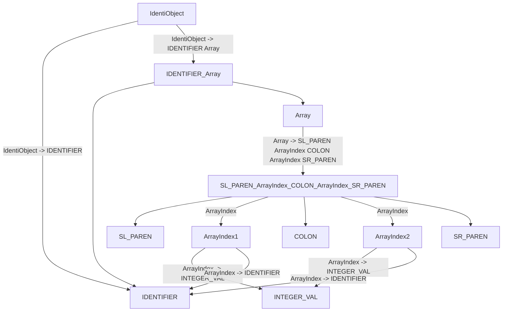

# 《编译原理》课程实验3报告

## 0221120281 文天鑫

### 实验目的

根据所学内容为扩展的PL0语言实现一个语法分析器

### 实验环境

- `GNU Flex` --词法分析模块
- `GNU Bison` --语法分析模块
- `Graphviz`、`dot`
- `C++`、`Python` --`C++`为词法分析与语法分析实现语言、`Python`为语法树实现的语言

### 实验思路（范式与流程）

#### 扩充PL0语言的EBNF范式

<程序> ::= <分程序>.

<分程序> ::= [<常量说明部分>] [<变量说明部分>] [<过程说明部分>] <语句>

<常量说明部分> ::= const <常量定义> { , <常量定义> };

<常量定义> ::=   <标识符> = <无符号整数>

<无符号整数> ::= <数字>{<数字>}

<变量说明部分> ::= var <变量声明> { , <变量声明> } ;

**<变量声明> ::= <标识符> | <标识符>(<数组界>:<数组界>）**

**<数组界> ::= <标识符> | <无符号整数>**

<标识符> ::= <字母>{<字母>|<数字>}

<过程说明部分> ::= <过程首部> <分程序> {; <过程说明部分> }; 

<过程首部> ::= procedure *<*标识符>

<语句> ::= <赋值语句> | <复合语句> | <条件语句> | <当型循环语句> | <重复语句> | <过程调用语句> | <读语句> | <写语句>

<赋值语句> ::= <变量引用>:=<表达式>

<变量引用> ::= <标识符> | <标识符>‘(‘<表达式> ‘)’

<复合语句> ::= begin <语句>{;<语句>}end

**<条件语句> ::= if <条件> then <语句> [else <语句>]**

<条件> ::= <表达式><关系运算符><表达式>|odd<表达式>

<表达式> ::= [+|-]<项>{<加法运算符><项>} 

<项> ::= <因子>{ <乘法运算符><因子> } 

<因子> ::= <变量引用> | <无符号整数> | ‘(‘<表达式>’)’

<加法运算符> ::= + | -

<乘法运算符> ::= * | /

<关系运算符> ::= = | # | < | <= | > | >=

<当型循环语句> ::= while <条件> do <语句>

<过程调用语句> ::= call <标识符>

<传值参数> ::= <表达式>

<读语句> ::= read ‘(’<变量引用> { , <变量引用> }‘)’

<写语句> ::= write‘(’<表达式> {, <表达式> }‘)’

<字母> ::= a|b|...|X|Y|Z

<数字> ::= 0|1|...|8|9

 #### Flex&Bison的工作流程


可执行文件res对测试文件进行语法分析，并将结果存储到输出文件中，再通过输出文件来进行语法树的绘制。

### 关键代码分析

#### 词法分析器部分

对于注释的处理

```lex
comment \{([^}]|\})*\}
```


要注意一种特殊情况，即注释语句中出现`}`的情况。为了防止该情况使得注释语句提前结束，这里我将两种情况分开分析，从而避免了注释提前终止。

#### 语法分析器部分

对于数组的处理

```yacc
IdentiObject   : IDENTIFIER {
                fprintf(fi,"IdentiObject -> IDENTIFIER\n");
                fprintf(fh,"IdentiObject -> IDENTIFIER\n");
            }
            | IDENTIFIER Array {
                fprintf(fi,"IdentiObject -> IDENTIFIER Array\n");
                fprintf(fh,"IdentiObject -> IDENTIFIER Array\n");
            }
            ;

Array       : SL_PAREN ArrayIndex COLON ArrayIndex SR_PAREN {
                fprintf(fi,"Array -> SL_PAREN ArrayIndex COLON ArrayIndex SR_PAREN\n");
                fprintf(fh,"Array -> SL_PAREN ArrayIndex COLON ArrayIndex SR_PAREN\n");
            }
            ;
            
ArrayIndex : INTEGER_VAL {
                fprintf(fi,"ArrayIndex -> INTEGER_VAL\n");
                fprintf(fh,"ArrayIndex -> INTEGER_VAL\n");
            }
            | IDENTIFIER {
                fprintf(fi,"ArrayIndex -> IDENTIFIER\n");
                fprintf(fh,"ArrayIndex -> IDENTIFIER\n");
            }
            ;
```



根据上面的范式与流程图进行处理数组

对于`else`的处理

```yacc
CondiStm    : IF Condition THEN Statements %prec LOWER_THAN_ELSE {
                fprintf(fi,"CondiStm -> IF Condition THEN Statement\n"); 
                fprintf(fh,"CondiStm -> IF Condition THEN Statement\n"); 
                 }
            | IF Condition THEN Statements ELSE Statements {
                fprintf(fi,"CondiStm -> IF Condition THEN Statement ELSE Statement\n");
                fprintf(fh,"CondiStm -> IF Condition THEN Statement ELSE Statement\n");
                  }
            ;
```

需要注意一种特殊情况。就是嵌套`if-else`所出现的冲突（也被称为悬空 else问题）

假设我们的输入是：`if (x > 0) if (x == 0) y = 0; else y = 1;`，那么语句最后的这个`else`是属于 前一个if还是后一个if呢？

这种情况下else总是匹配距离它最近的那个`if`，这与Bison的默认处理方式（移入/归约冲突时总是移入）是一致的。因此即使我们不在Bison源代码里对这个问题进行任何处理，最后生成的语法分析程序的行为也是正确的。但如果不处理，Bison总是会提示我们该语法中存在一个移入/归约冲突。

显式地解决悬空`else`问题可以借助于算符的优先级。Bison源代码中每一条产生式后面都可以紧跟一个`%prec`标记，指明该产生式的优先级等同于一个终结符。如例子中我们新定义的`token`：`LOWER_THAN_ELSE`一样，这样可以降低规约对于移入的优先级。

### 一些修改与改进

词法分析器(`LexicalPl0.l`)

- 使用`strcasecmp()`函数进行不区分大小写的匹配
- 每当扫描到一个词将它规约为token的时候返回对应的词法匹配结果
- 将输出文件细分为两个，一个为整体结果，另一个为方便`Debug`与建立语法树的详细结果。

语法分析器(`LexicalPl0.l`)

- 使用`%union`来实现一个结构体用来存储类型，这样做可以节省内存。

语法树生成部分(`draw2ast.py`)

- 使用python语言

